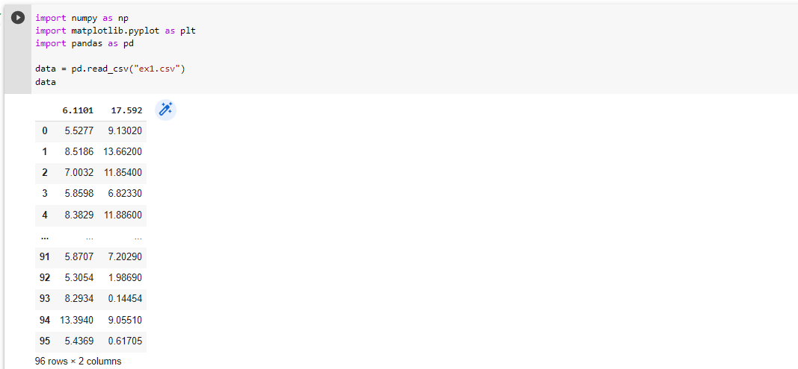
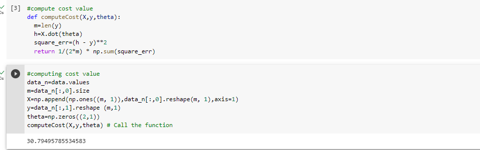
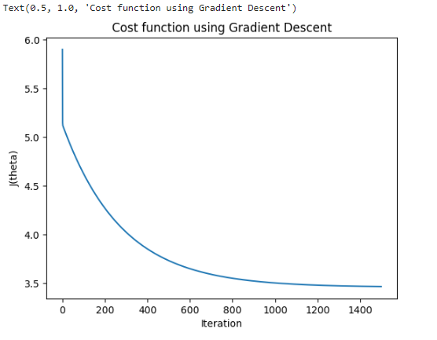
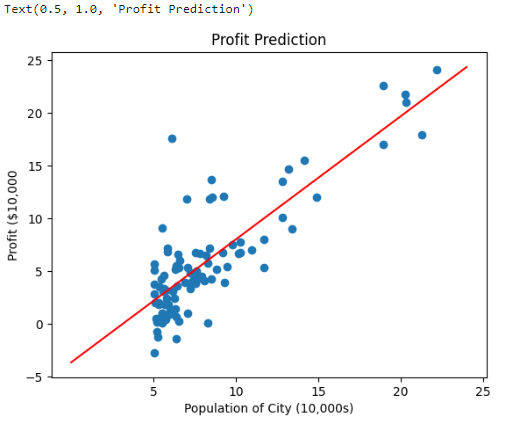
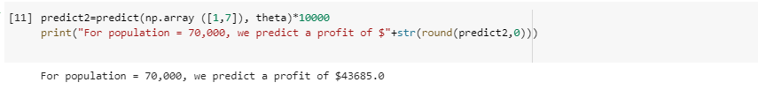
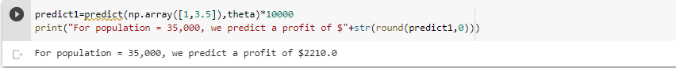

# Implementation-of-Linear-Regression-Using-Gradient-Descent

## AIM:
To write a program to predict the profit of a city using the linear regression model with gradient descent.

## Equipments Required:
1. Hardware – PCs
2. Anaconda – Python 3.7 Installation / Jupyter notebook

## Algorithm
1. Import the standard libraries in python required for finding Gradient Design.
2. Read the dataset file and check any null value using the .isnull() method.
3. Declare the default variables with respective values for linear regression.
4. Calculate the loss using Mean Square Error.
5. Predict the value of y.
6. Plot the graph with respect to hours and scores using the .scatterplot() method
for Linear Regression.
7. Plot the graph with respect to loss and iterations using the .plot() method for
Gradient Descent.
## Program:
```
/*
Program to implement the linear regression using gradient descent.
Developed by: Sowjanya S
RegisterNumber:  212220040158
*/
import numpy as np
import matplotlib.pyplot as plt
import pandas as pd

data = pd.read_csv("/content/ex1.csv")
data

#compute cost value
def computeCost(X,y,theta):
  m=len(y) 
  h=X.dot(theta) 
  square_err=(h - y)**2
  return 1/(2*m) * np.sum(square_err) 
  
 #computing cost value
data_n=data.values
m=data_n[:,0].size
X=np.append(np.ones((m, 1)),data_n[:,0].reshape(m, 1),axis=1)
y=data_n[:,1].reshape (m,1) 
theta=np.zeros((2,1))
computeCost(X,y,theta) # Call the function

def gradientDescent (X,y, theta, alpha, num_iters):
  m=len (y)
  J_history=[]
  
  for i in range(num_iters):
    predictions = X.dot(theta)
    error = np.dot(X.transpose(), (predictions -y))
    descent=alpha * 1/m * error 
    theta-=descent
    J_history.append(computeCost (X,y, theta))
  return theta, J_history
  
  #h(x) value
theta,J_history = gradientDescent (X,y, theta, 0.01,1500)
print ("h(x) ="+str (round(theta[0,0],2))+" + "+str(round(theta[1,0],2))+"X1")

plt.plot(J_history)
plt.xlabel("Iteration") 
plt.ylabel("$J(theta)$")
plt.title("Cost function using Gradient Descent")

plt.scatter(data['a'],data['b'])
x_value=[x for x in range (25)]
y_value=[y*theta[1]+theta[0] for y in x_value]
plt.plot(x_value,y_value, color="r")
plt.xticks(np.arange (5,30,step=5)) 
plt.yticks(np.arange(-5,30,step=5)) 
plt.xlabel("Population of City (10,000s)") 
plt.ylabel("Profit ($10,000") )
plt.title("Profit Prediction")
# Text(0.5, 1.0, 'Profit Prediction')

def predict (x,theta):
# 11 11 11
# Takes in numpy array of x and theta and return the predicted value of y based on theta
  predictions= np.dot (theta.transpose (),x)
  return predictions[0]
  
predict1=predict(np.array([1,3.5]),theta)*10000
print("For population = 35,000, we predict a profit of $"+str(round(predict1,0)))

predict2=predict(np.array ([1,7]), theta)*10000
print("For population = 70,000, we predict a profit of $"+str(round(predict2,0)))
```

## Output:









## Result:
Thus the program to implement the linear regression using gradient descent is written and verified using python programming.
